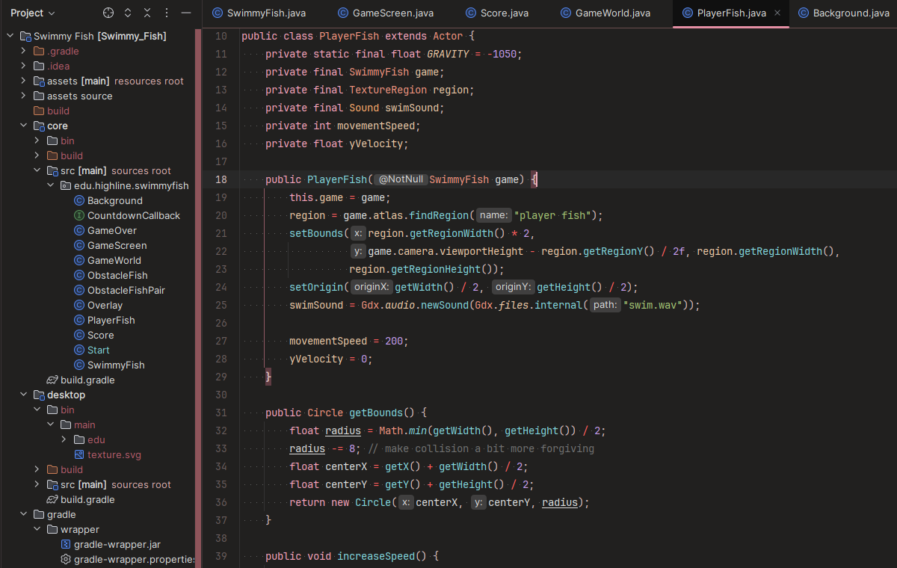

Theme & color scheme plugin made for JetBrains IDEs.

<!-- Plugin description -->
I couldn't find a theme that fit all my criteria, so I made my own. Welcome to **CutiePro**, a modern theme that's:
- Dark and easy on the eyes
- Legible and expressive
- Pastel, with a focus on pink and warm colors
- But most of all... cute! Not afraid to be both feminine and stylish

Development is active, so expect continual improvements. If you have any suggestions or feedback, feel free to write a review, open an issue on GitHub, or email me!

 

Inspired by [Girly Theme](https://marketplace.visualstudio.com/items?itemName=clari-codes.clari-codes-theme) for VS Code.

Temporary icon adapted from a free [vectorportal.com](https://vectorportal.com/vector/plush-octopus/35221) stock vector.
<!-- Plugin description end -->
